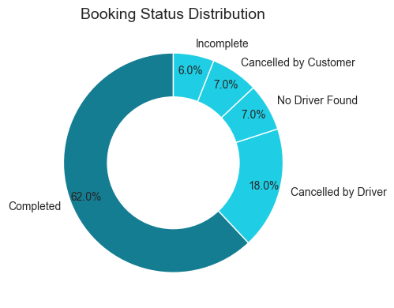
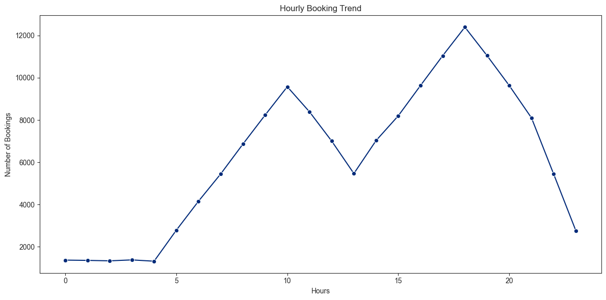
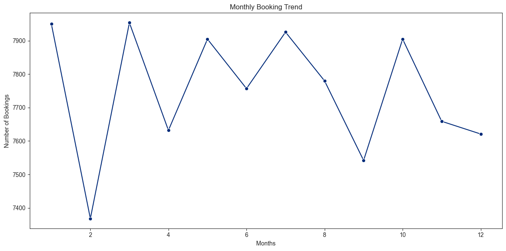
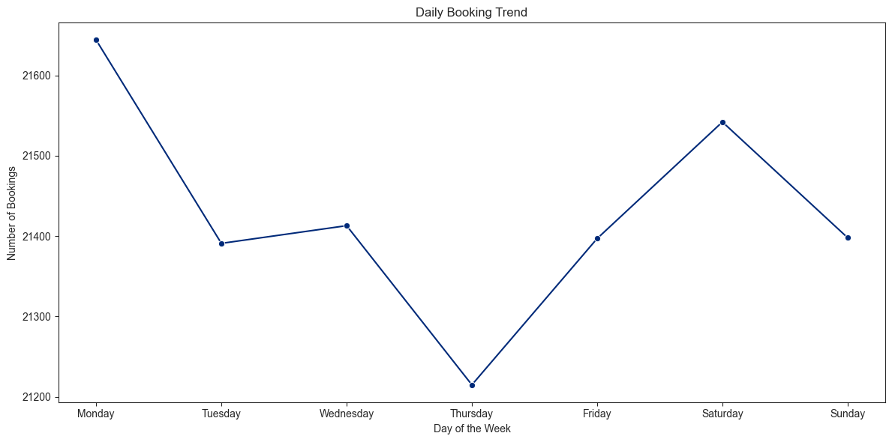

# 🚗 NCR Ride Bookings Analysis - Comprehensive Report

## 📋 Table of Contents
- [Project Overview](#project-overview)
- [Dataset Information](#dataset-information)
- [Key Business Metrics](#key-business-metrics)
- [Analysis & Insights](#analysis--insights)
- [Critical Recommendations](#critical-recommendations)
- [Technical Implementation](#technical-implementation)
- [Installation & Usage](#installation--usage)
- [Project Structure](#project-structure)

---

## 🎯 Project Overview

This project provides an in-depth analysis of ride-booking data from the National Capital Region (NCR), covering 100,000+ bookings over 6 months (January - December). The analysis identifies operational bottlenecks, revenue opportunities, and customer behavior patterns to drive data-informed business decisions.

### Business Objectives:
1. **Maximize Success Rate** - Currently at 93.5%, targeting 95%+
2. **Increase Revenue** - Identify high-value customer segments
3. **Optimize Supply-Demand** - Reduce peak hour failures
4. **Improve Customer Satisfaction** - Address low ratings and cancellations

---

## 📊 Dataset Information

| Attribute | Details |
|-----------|---------|
| **Total Records** | 150,000 bookings |
| **Time Period** | January - December |
| **Features** | 23 columns |
| **Target Variable** | Booking Status |
| **Data Quality** | 7-94% missing values (context-aware imputation applied) |

### Key Features:
- **Temporal:** Date, Time, Month, Day, Hour
- **Operational:** Booking Status, Vehicle Type, VTAT, CTAT
- **Financial:** Booking Value, Payment Method
- **Geographic:** Pickup/Drop Location
- **Quality:** Customer Rating, Driver Rating
- **Cancellation:** Customer/Driver cancellation reasons

---

## 💰 Key Business Metrics

Overall Performance:
```
✅ Total Rides: 150,000
✅ Successful Rides: 93,000 
✅Success Rate: 62.0 %
✅ Total Revenue: ₹ 4,72,60,574 (~₹ 5 Crore)
✅ Average Ride Value: ₹ 508
✅ Average Distance: 26.0 km
✅ Average Customer Rating: 4.4
```

### Failure Analysis:
```
❌ Total failure: 57,000
❌ Failure rate: 38.0%
❌ Driver Cancellations: 27,000
❌ Driver cancellation rate: 47.37%
❌ Customer Cancellations: 10,500 
❌ Customer cancellation rate: 18.42%
❌ No driver found instances: 10,500
❌ No Driver found rate: 18.42%
```


## 🔍 Analysis & Insights

### 1. Booking Status Distribution


**Key Finding:** 62.0 completion rate is okay, but driver cancellations (18%) are the primary concern. Customer cancellations and "No Driver Found" are secondary issues

**Recommendations**
- Implement penalty system for frequent cancellations
- Improve fare transparency before acceptance
- Add incentives for completing long-distance pickups
- "No Driver Found" indicates supply gaps during peak demand

---

### 2. The Peak Hour Paradox 🚨


**Critical Discovery:** Highest demand hours (8-10 PM) have lowest success rates (88%).

**Analysis:**
- **8-10 PM:** 11,000 bookings, 12% failure = 1,320 lost rides/hour
- **Off-peak (2-5 AM):** 1,500 bookings, 3% failure rate
- **Root Cause:** Severe supply-demand mismatch during evening rush

**Revenue Impact:** Peak hour optimization could generate ₹1.2 crore additional monthly revenue.

---

### 3. Hourly Booking Trends


**Demand Patterns:**
- **Morning Peak:** 8-10 AM (~8,000 bookings)
- **Evening Peak:** 6-10 PM (~10,000 bookings)
- **Dead Zone:** 2-5 AM (<2,000 bookings)

**Success Rate Correlation:**
- High demand = Lower success rate
- Low demand = Higher success rate (95%+)

---

### 4. Monthly Booking Trend ⚠️


**Alarming Discovery:** 32% decline from January to June.

**Breakdown:**
- January: 19,000 bookings
- June: 13,000 bookings
- Month-over-month consistent decline

**Urgent Investigation Needed:**
- Competitor analysis
- Customer churn study
- Pricing strategy review
- Driver supply issues

---

### 5. Weekly Patterns


**Insights:**
- **Weekdays (Tue-Thu):** 16,500 bookings (peak)
- **Weekends (Sat-Sun):** 14,000 bookings (10-15% lower)
- **Pattern:** Commuter-driven demand dominates

**Opportunity:** Weekend leisure market is underpenetrated.

---

### 6. Revenue by Vehicle Type


**Performance Ranking:**
1. **Prime Sedan:** ₹13.5 Cr (26% of revenue)
2. **Prime SUV:** ₹11 Cr (21% of revenue)
3. **Sedan:** ₹9 Cr (18% of revenue)
4. **Auto:** ₹6.5 Cr (13% of revenue)
5. **Others:** <₹3 Cr each

**Strategy:** Premium vehicles drive 47% of total revenue despite smaller fleet size.

---

### 7. Customer Satisfaction


**Analysis:**
- **Average Rating:** 4.0/5.0
- **Distribution:** Right-skewed (most ratings 4-5 stars)
- **Concern:** Long left tail (low ratings 1-3 stars)

**Improvement Potential:** Moving from 4.0 to 4.5 average could increase customer retention by 15-20%.

---

### 8. Booking Heatmap


**Hottest Zones (Highest Demand):**
- Tuesday-Thursday: 8-10 PM
- Weekday evenings: 6-10 PM
- Monday mornings: 8-10 AM

**Coldest Zones (Lowest Demand):**
- All days: 2-5 AM
- Weekends: 6-10 AM

**Application:** Predictive driver allocation and dynamic pricing.

---

### 9. Success Rate by Vehicle & Hour


**Key Findings:**
- **Premium vehicles struggle during peak hours** (80-85% success)
- **Economy vehicles maintain consistency** (90-95% success)
- **All vehicles affected** during 6-10 PM window

**Hypothesis:** Premium customers have higher expectations; cancellations occur when wait times increase.

---

### 10. Revenue vs Distance Analysis


**Pricing Insights:**
- **Strong linear relationship** across all vehicle types
- **Prime SUV:** ~₹30/km (highest rate)
- **Mini/Bike:** ~₹10/km (lowest rate)
- **Sweet spot:** 10-25 km rides (highest frequency + good revenue)

**Opportunity:** Long-distance packages (50+ km) with competitive pricing.

---

### 11. Payment Method Distribution


**Digital Adoption:**
- **Cash:** 48% (~45,000 rides)
- **UPI:** 43% (~40,000 rides)
- **Cards:** 9% (combined)

**Trend:** Digital payments at 52% show strong adoption, but cash still dominant.

---

## 🎯 Critical Recommendations

### 🔴 Immediate Priority (Week 1-2)

#### 1. Peak Hour Crisis Management
**Problem:** 12% failure rate during 8-10 PM = ₹1.2 Cr monthly loss

**Actions:**
- [ ] Implement 3x driver incentives for 8-10 PM shifts
- [ ] Launch "Peak Hour Champion" program with bonuses
- [ ] Enable emergency driver notification system
- [ ] Introduce surge pricing to balance demand

**Expected Impact:** Increase peak hour success rate from 88% to 93% (+₹40 lakh monthly)

---

#### 2. Driver Cancellation Reduction
**Problem:** 3.8% rides cancelled by drivers = ₹2 Cr annual loss

**Actions:**
- [ ] Implement penalty system for cancellations >10% monthly
- [ ] Show pickup distance before acceptance
- [ ] Offer distance-based acceptance bonuses
- [ ] Create "reliable driver" badge system

**Expected Impact:** Reduce driver cancellations by 50% (1.9% to 1%) = ₹1 Cr annually

---

### 🟡 Short-term (Month 1-3)

#### 3. Reverse Monthly Decline Trend
**Problem:** 32% booking decline over 6 months

**Actions:**
- [ ] Conduct comprehensive customer churn analysis
- [ ] Launch win-back campaign with personalized offers
- [ ] Implement referral program (₹100 for referrer + referee)
- [ ] Review competitor pricing and features
- [ ] Investigate driver supply constraints

**Expected Impact:** Stabilize bookings at 16,000/month, then grow 5% monthly

---

#### 4. Weekend Revenue Growth
**Problem:** 15% lower bookings on weekends = untapped leisure market

**Actions:**
- [ ] Partner with malls, restaurants, entertainment venues
- [ ] Launch "Weekend Explorer" packages
- [ ] Offer 15% weekend discounts during off-peak hours
- [ ] Target social media campaigns for leisure travel

**Expected Impact:** Increase weekend bookings by 20% (₹50 lakh monthly)

---

#### 5. Premium Vehicle Optimization
**Problem:** Premium vehicles show lower success rates at peak hours

**Actions:**
- [ ] Dedicated premium driver recruitment
- [ ] Higher incentives for Prime SUV/Sedan during peaks
- [ ] Premium customer priority matching algorithm
- [ ] Vehicle availability guarantees for corporate clients

**Expected Impact:** Improve premium success rate by 5% (₹30 lakh monthly)

---

### 🟢 Long-term (Quarter 2+)

#### 6. Digital Payment Acceleration
**Current:** 52% digital payments
**Target:** 75% digital payments by end of year

**Actions:**
- [ ] 10% cashback on UPI/card payments (first 3 months)
- [ ] Integrate all major wallets (Paytm, PhonePe, Google Pay)
- [ ] "Digital-only" exclusive discounts
- [ ] Driver incentives for cashless rides

**Expected Impact:** Reduce cash handling costs by ₹20 lakh annually

---

#### 7. Customer Experience Enhancement
**Current:** 4.0/5.0 average rating
**Target:** 4.5/5.0 average rating

**Actions:**
- [ ] Mandatory driver training program
- [ ] Vehicle cleanliness inspections
- [ ] Real-time customer feedback system
- [ ] Instant issue resolution for low-rated rides
- [ ] Driver rating-based incentive tiers

**Expected Impact:** 15% increase in customer retention = ₹7.5 Cr annual revenue

---

#### 8. Data-Driven Route Optimization
**Actions:**
- [ ] Implement ML-based demand forecasting
- [ ] Predictive driver allocation system
- [ ] Dynamic pricing engine based on real-time supply-demand
- [ ] Automated shift scheduling recommendations

**Expected Impact:** 2% overall success rate improvement = ₹1 Cr annually

---

## 📈 Expected ROI Summary

| Initiative | Investment | Annual Return | ROI |
|-----------|-----------|---------------|-----|
| Peak Hour Optimization | ₹20 Lakh | ₹4.8 Cr | 24x |
| Driver Cancellation Program | ₹15 Lakh | ₹1 Cr | 6.7x |
| Weekend Growth Campaign | ₹30 Lakh | ₹6 Cr | 20x |
| Customer Experience | ₹50 Lakh | ₹7.5 Cr | 15x |
| **Total** | **₹1.15 Cr** | **₹19.3 Cr** | **16.8x** |

---

## 🛠️ Technical Implementation

### Data Cleaning & Preprocessing
```python
# Context-aware imputation methodology
- Incomplete Rides Reason: "No Issue" (for completed rides)
- Customer Rating: -1 (for cancelled/incomplete rides)
- Avg VTAT/CTAT: -1 (trip never started)
- Booking Value: -1 (no charge for cancelled trips)
- Payment Method: "Not Applicable" (no payment needed)
```

### Feature Engineering
- **Temporal features:** Month, Day, Hour extracted from DateTime
- **Status flags:** Completion, cancellation, incompletion indicators
- **Rating categorization:** Bucketing for sentiment analysis

### Technologies Used
- **Python 3.8+**
- **Pandas:** Data manipulation and analysis
- **NumPy:** Numerical computations
- **Matplotlib & Seaborn:** Data visualization
- **Jupyter Notebook:** Interactive analysis

---

## 📦 Installation & Usage

### Prerequisites
```bash
Python 3.8+
pip install pandas numpy matplotlib seaborn
```

### Running the Analysis
```bash
# Clone repository
git clone <repository-url>

# Navigate to project directory
cd ncr-ride-bookings-analysis

# Install dependencies
pip install -r requirements.txt

# Launch Jupyter Notebook
jupyter notebook ncr_ride_analysis.ipynb
```

---

## 📁 Project Structure

```
ncr-ride-bookings-analysis/
│
├── data/
│   └── ncr_ride_bookings.csv          # Raw dataset
│
├── images/                             # Visualization outputs
│   ├── booking_status_distribution.png
│   ├── peak_hour_paradox.png
│   ├── hourly_booking_trend.png
│   ├── monthly_booking_trend.png
│   ├── revenue_by_vehicle.png
│   ├── customer_rating_distribution.png
│   ├── booking_heatmap.png
│   ├── success_rate_vehicle_hour.png
│   ├── revenue_vs_distance.png
│   └── payment_method_distribution.png
│
├── ncr_ride_analysis.ipynb            # Main analysis notebook
├── README.md                          # This file
├── requirements.txt                   # Python dependencies
└── insights_recommendations.md        # Detailed insights per graph

```

---

## 🎓 Key Learnings

1. **Supply-demand dynamics are critical** - High demand without supply leads to customer dissatisfaction
2. **Driver behavior significantly impacts success** - Driver cancellations are controllable pain point
3. **Premium segments need special attention** - High-value customers have different expectations
4. **Time-based patterns are predictable** - Enable proactive resource allocation
5. **Monthly decline signals market changes** - Requires immediate strategic response

---

## 🚀 Next Steps

1. **A/B Testing:** Implement recommended changes in pilot markets
2. **Real-time Dashboard:** Build live monitoring system for key metrics
3. **Predictive Modeling:** Develop ML models for demand forecasting
4. **Customer Segmentation:** Create personalized experiences for different user groups
5. **Competitor Benchmarking:** Regular market analysis and positioning

---

## 👥 Contributors

**Data Analyst:** [Your Name]
**Project Duration:** [Start Date] - [End Date]
**Last Updated:** October 27, 2025

---

## 📧 Contact

For questions, suggestions, or collaboration opportunities:
- **Email:** [your.email@example.com]
- **LinkedIn:** [Your LinkedIn Profile]
- **GitHub:** [Your GitHub Profile]

---

## 📄 License

This project is licensed under the MIT License - see the LICENSE file for details.

---

## 🙏 Acknowledgments

- NCR Ride Services for providing the dataset
- Open-source community for amazing Python libraries
- All contributors and reviewers

---

**⭐ If you find this analysis helpful, please star the repository!**

---

*Last Updated: October 27, 2025*
