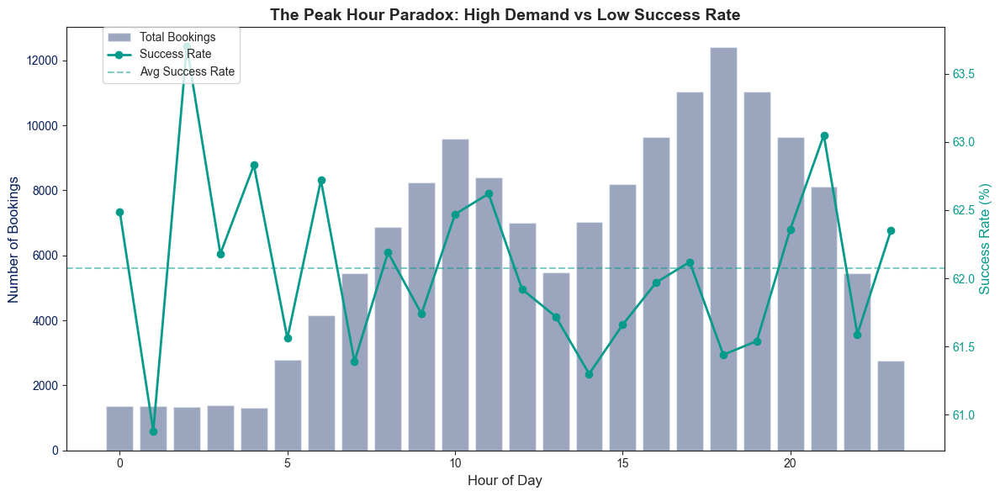
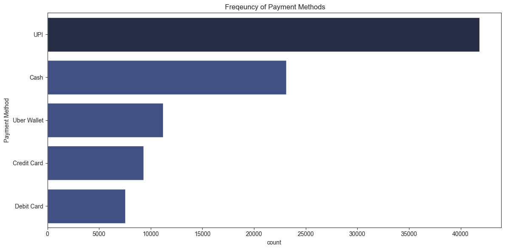

# 🚗 UBER Analysis - Comprehensive Report

---

## 🎯 Project Overview

This project provides an in-depth analysis of ride-booking data from the National Capital Region (NCR), covering 100,000+ bookings over 12 months (January - December). The analysis includes data cleaning, missing value assessment, exploratory data analysis (EDA), and visualization to uncover key business insights. Metrics such as ride success rate, vehicle-wise revenue, hourly demand trends, payment preferences, and customer ratings were examined to evaluate overall platform performance. The findings highlight peak-hour supply shortages, incomplete data collection on cancellations, and varying revenue contributions across vehicle types, informing strategic recommendations to improve driver allocation, data capture,  customer experience, and customer behavior patterns to drive data-informed business decisions.

### Business Objectives:
**1. Improve Ride Completion Rate:**
Identify key reasons for ride failures and cancellations to increase the percentage of successful bookings.

**2. Optimize Driver Supply According to Demand:**
Analyze peak demand hours and locations to ensure the right number of drivers are available at the right time.

**3. Maximize Revenue Across Vehicle Types:**
Evaluate revenue contribution by each vehicle segment to adjust pricing, promotions, and fleet allocation effectively.

---

## 📊 Dataset Information

| Attribute | Details |
|-----------|---------|
| **Total Records** | 150,000 bookings |
| **Time Period** | January - December |
| **Features** | 23 columns |
| **Target Variable** | Booking Status |
| **Data Quality** | 7-94% missing values (context-aware imputation applied) |

### Key Features:
- **Temporal:** Date, Time, Month, Day, Hour
- **Operational:** Booking Status, Vehicle Type, VTAT, CTAT
- **Financial:** Booking Value, Payment Method
- **Geographic:** Pickup/Drop Location
- **Quality:** Customer Rating, Driver Rating
- **Cancellation:** Customer/Driver cancellation reasons

---

## 💰 Key Business Metrics

Overall Performance:
```
✅ Total Rides: 150,000
✅ Successful Rides: 93,000 
✅Success Rate: 62.0 %
✅ Total Revenue: ₹ 4,72,60,574 (~₹ 5 Crore)
✅ Average Ride Value: ₹ 508
✅ Average Distance: 26.0 km
✅ Average Customer Rating: 4.4
```

### Failure Analysis:
```
❌ Total failure: 57,000
❌ Failure rate: 38.0%
❌ Driver Cancellations: 27,000
❌ Driver cancellation rate: 47.37%
❌ Customer Cancellations: 10,500 
❌ Customer cancellation rate: 18.42%
❌ No driver found instances: 10,500
❌ No Driver found rate: 18.42%
```


## 🔍 Analysis & Insights

### 1. Booking Status Distribution


Key Insights:
- 62% of total bookings are successfully completed, indicating that the platform is functioning well but still has room to improve reliability.

- 18% of bookings are cancelled by drivers, which is significant and suggests supply-side reliability or incentive issues.

Recommendation:
→ Investigate driver cancellation reasons and introduce targeted driver incentives to reduce the 18% cancellation rate.

---

### 2. Success Rate by Hour of the Day


Key Insights:
- Success rate peaks around 2 AM (~63.7%), likely due to lower demand and less competition for driver availability.

- Success rate dips between 1–3 PM (~61.2–61.6%), suggesting possible supply shortage or high demand during afternoon hours.

Recommendation:
→ Deploy more driver availability or surge pricing between 1–3 PM to stabilize success rates.

---

### 3. Hourly Booking Trends


Key Insights:
- Bookings are very low during early morning hours (12 AM–4 AM) and gradually increase after 6 AM.

- Peak demand occurs around 7 PM (~12,300 bookings), followed by a decline late at night.

Recommendation:
→ Increase driver supply and reduce rider wait times during peak evening hours (6–9 PM) to maximize fulfillment and revenue.

---

### 4. Weekly Patterns


Key Insights:
- Monday has the highest booking volume (~21650+ bookings), showing stronger demand at the start of the week.

- Thursday sees the lowest booking count (~21200) before it rises again towards the weekend.

Recommendation:
→ Introduce mid-week offers or driver incentives on Thursdays to boost booking volume.

---

### 5. The Peak Hour Paradox: High Demand vs Low Success Rate


Key Insights:
- Demand peaks between 17:00–21:00, but success rate dips below average (~61–62%) during the same period — indicating driver shortage or increased cancellations during peak hours.

- Early morning hours (2:00–7:00) show low demand but higher success rates, meaning supply is adequate when demand is low — confirming capacity strain is time-specific.

Recommendation:
→  Introduce time-based surge incentives for drivers from 5 PM to 9 PM to align supply with peak demand and improve ride completion rates.

---

### 6. Revenue by Vehicle Type


Key Insights:
- Auto generates the highest revenue (~1.16 crore), indicating it is the most preferred and frequently used mode.

- Uber XL contributes the lowest revenue (~0.14 crore), suggesting lower demand or a niche user segment.

Recommendation:
→ Focus marketing and operational optimization around Auto and Go Mini while evaluating pricing or repositioning strategies for Uber XL.

---

### 7. Customer Satisfaction


Key Insights:
- The majority of customer ratings are between 4.2 and 5.0, showing generally high customer satisfaction.

- A noticeable peak at the rating 5.0 indicates many users give the maximum rating, suggesting positive service experience but also potential rating bias.

Recommendation:
→ Analyze feedback from users rating below 4.0 to identify specific service pain points and improve customer experience.

---

### 8. Booking by day & hour Heatmap


Key Insights:
- Peak demand consistently occurs between 6 PM and 8 PM across all days, with the highest intensity around 7 PM.
→ This is likely due to office commute + evening travel needs.

- Early morning hours (12 AM to 5 AM) have very low demand on all days.
→ Demand remains minimal until around 6 AM, when it begins rising steadily.

- Mid-day (12 PM–3 PM) bookings show moderate activity, but still noticeably lower than morning and evening peaks.
→ Suggests lunchtime & casual travel demand, but not a driver shortage zone.

- Booking patterns are consistent across all weekdays and weekends, meaning demand cycles are predictable, not random.

Recommendation:
→ Increase driver availability and dynamic pricing during 6 PM–9 PM to maximize ride fulfillment and revenue, while reducing idle time during early mornings.

---

### 9. Success Rate by Vehicle & Hour


Key Insights:
- Go Sedan has the highest success rate during early morning hours (2–4 AM), reaching ~69–70%.
→ This indicates low demand but consistent supply, making trips more likely to complete successfully.

- Premier Sedan and Uber XL show the lowest success rates during peak commute hours (8–11 AM and 6–9 PM), dropping to ~56–58%.
→ This shows demand exceeds supply for premium vehicle categories during busy periods, leading to higher cancellations.

Recommendation:
→ Increase driver incentives specifically for Premier Sedan and Uber XL during morning and evening peak hours to close the supply gap and improve completion rates.

---

### 10. Revenue vs Distance Analysis


Key Insights:
- Revenue increases proportionally with ride distance across all vehicle types, confirming a clear distance-based pricing model rather than time-based or dynamic cost variation.

- Premier Sedan and Uber XL show consistently higher revenue for the same distance compared to Auto, Bike, and Go Mini — indicating premium pricing elasticity and higher margin contribution from longer trips.

Recommendation:
→ Promote Premier Sedan and Uber XL through targeted offers for long-distance airport/outstation routes to maximize high-value ride share and boost overall revenue margin.

---

### 11. Payment Method Distribution


Key Insights:
- UPI is the dominant payment method, accounting for the highest share (~40k+ transactions) — indicating strong user preference for fast, cashless, low-friction payments.

- Cash is the second-most used payment method (~23k transactions), showing that a significant portion of users still depend on cash, likely due to driver preference or inconsistent digital payment reliability.

Recommendation:
→ Introduce small cashback or loyalty points for UPI and Uber Wallet payments to further reduce cash dependency and improve payment processing efficiency.

---

## 🛠️ Technical Implementation

### Data Cleaning & Preprocessing
```python
# Context-aware imputation methodology
- Incomplete Rides Reason: "No Issue" (for completed rides)
- Customer Rating: -1 (for cancelled/incomplete rides)
- Avg VTAT/CTAT: -1 (trip never started)
- Booking Value: -1 (no charge for cancelled trips)
- Payment Method: "Not Applicable" (no payment needed)
```

### Feature Engineering
- **Engineered new feature** from date and time to date time
- **Temporal features:** Month, Day, Hour extracted from DateTime


### Technologies Used
- **Python 3.8+**
- **Pandas:** Data manipulation and analysis
- **NumPy:** Numerical computations
- **Matplotlib & Seaborn:** Data visualization
- **Jupyter Notebook:** Interactive analysis

---

## 📧 Contact

For questions, suggestions, or collaboration opportunities:
- **Email:** saranchmukhia@gmail.com
- **LinkedIn:** https://www.linkedin.com/in/sharanch-mukhia-633b7830a/

---

## 📄 License

This project is licensed under the MIT License - see the LICENSE file for details.

---

## 🙏 Acknowledgments

- NCR Ride Services for providing the dataset
- Open-source community for amazing Python libraries
- All contributors and reviewers

---

**⭐ If you find this analysis helpful, please star the repository!**

---

*Last Updated: October 27, 2025*
